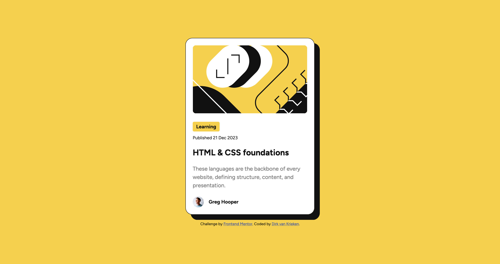

# Frontend Mentor - Blog preview card solution

This is a solution to the [Blog preview card challenge on Frontend Mentor](https://www.frontendmentor.io/challenges/blog-preview-card-ckPaj01IcS). 

## Table of contents

- [Overview](#overview)
  - [The challenge](#the-challenge)
  - [Screenshot](#screenshot)
  - [Links](#links)
- [My process](#my-process)
  - [Built with](#built-with)
  - [What I learned](#what-i-learned)
- [Author](#author)


## Overview

### The challenge

Users should be able to:

- See hover and focus states for all interactive elements on the page

### Screenshot




### Links

- Solution URL: [https://github.com/dirkvankrieken/blog-preview-card](https://github.com/dirkvankrieken/blog-preview-card)
- Live Site URL: [https://dirkvankrieken.github.io/blog-preview-card/](https://dirkvankrieken.github.io/blog-preview-card/)

## My process

### Built with

- Semantic HTML5 markup
- CSS custom properties
- Flexbox
- Mobile-first workflow

### What I learned

I learned how to use 'rem' (relative to the root font-size) for the font-sizes to match the design version as closely as possible.
I learned to use a :hover state on an element for interactivity. (changing the color of a heading when hovering with the mouse over the element.)

Use this section to recap over some of your major learnings while working through this project. Writing these out and providing code samples of areas you want to highlight is a great way to reinforce your own knowledge.

To see how you can add code snippets, see below:

```css
h1:hover {
	color: var(--yellow);
}
```

## Author

- Website - [dirkvankrieken.com](https://dirkvankrieken.com)
- Frontend Mentor - [@dirkvankrieken](https://www.frontendmentor.io/profile/dirkvankrieken)
